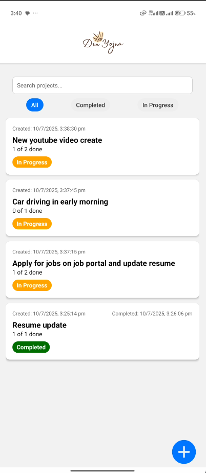
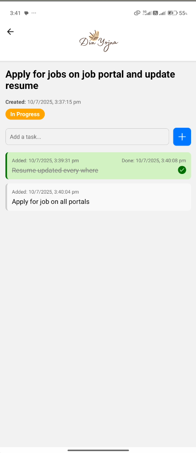
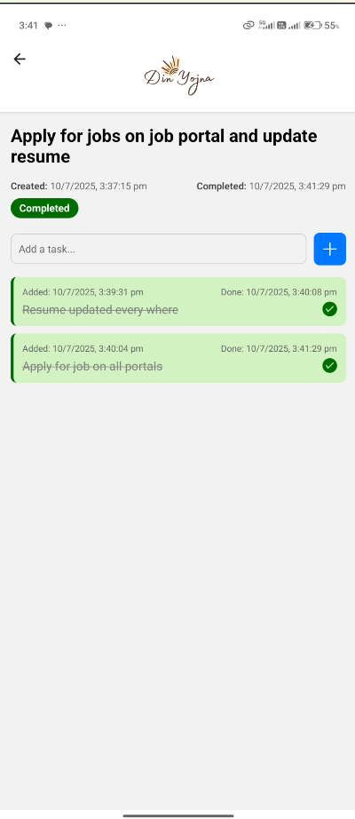
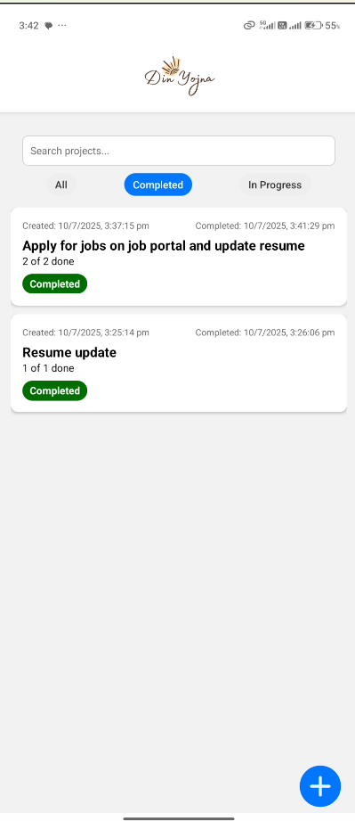

# Din Yojna – Smart Project & Task Manager (React Native)

Din Yojna is a mobile productivity app built using React Native and Expo. It helps you organize your daily work by grouping tasks under projects with intuitive features like task completion, renaming, deadlines, and progress tracking.

---

## Features

- Create and manage multiple projects
-  Add, rename, complete, and delete tasks
-  Project progress tracking
-  Search and filter projects (All / Completed / In Progress)
-  Created & Completed timestamps for projects and tasks
-  Swipe to delete (tasks/projects)
-  Responsive, clean UI with floating action button

---

## Screenshots





---

## Tech Stack

- [React Native](https://reactnative.dev/)
- [Expo](https://expo.dev/)
- React Navigation
- AsyncStorage (for local data storage)
- Gesture Handler for swipe actions

---

## Installation & Running Locally

### Prerequisites

- Node.js
- Yarn or npm
- Expo CLI

### Clone & Start

```bash
git clone https://github.com/tusharharyana/din-yojna.git
cd din-yojna
npm install
npx expo start
```

## Challenges Faced

- This was the first app I created using Expo. Before this, I had only used Android Studio to run emulators and build native apps, so adapting to Expo’s workflow and ecosystem was a new learning experience.

## What Could Be Improved
While Din Yojna currently functions as a standard to-do and project management app, there is great potential to make it smarter with AI-powered features:

- AI-Powered Task Suggestions: Automatically suggest tasks based on time of day, user behavior, or past project activity.

- Priority Detection: Use natural language processing (NLP) to detect urgency or importance in task titles and flag them accordingly.

- Conversational Task Entry: Allow users to input tasks using natural language — e.g., "Remind me to call mom tomorrow at 8 PM" — and have the app parse and schedule it automatically.

- Smart Reminders: Notify users if a project is inactive for too long or if important deadlines are approaching.

- OpenAI (Gemini) Integration: Connect to LLM APIs to provide personalized task insights, generate summaries, or offer task suggestions dynamically.

I've already implemented some of these features in a separate project:
[Smart To-Do List with AI](https://github.com/tusharharyana/smart-todo-list-with-AI).

